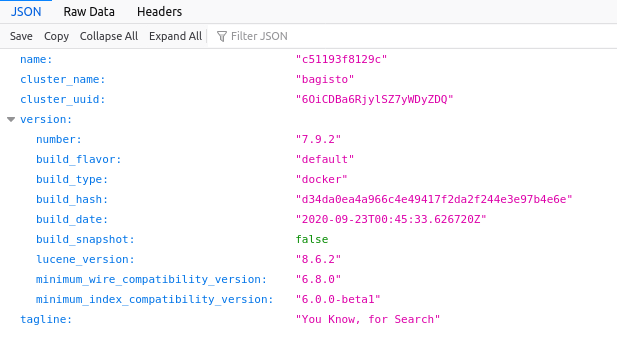

# Indexing products to Elasticsearch

In this section, we will explain the indexing of products from the database to the Elasticsearch engine.

## Setting up environment

To continue with this make sure you have [Elasticseach](https://www.elastic.co/guide/en/elasticsearch/reference/current/install-elasticsearch.html) installed on your system. By default, Elasticsearch uses the `9200` port. So, we are using the same port.

Just hit this route `http://localhost:9200`, if you see the below image then Elasticsearch is successfully installed on your system,

::: tip

If you want to use curl, you can hit this command,

~~~sh
curl -X GET 'http://localhost:9200'
~~~

:::

You can use [Kibana](https://www.elastic.co/guide/en/kibana/7.10/index.html) for visualization also, but in this section, we are using only the Elasticsearch engine.

## Setting up config

The most simple way to set up your environment is by just setting the key in the `.env` file.

- Now, open the `.env` file in your project and this line,

  ~~~env
  SCOUT_DRIVER=elastic
  ELASTIC_HOST="localhost:9200"
  ~~~

- After that run `php artisan config:cache`.

- Done! Now you are all set to index your products.

::: tip

If still it is not working, then you can directly set your config in the following files i.e.,

- `config/elastic.client.php`

  ~~~php
  ...

  'hosts' => [
      env('ELASTIC_HOST', 'localhost:9200'),
  ]

  ...
  ~~~

- `config/scout.php`

  ~~~php
  ...

  'driver' => env('SCOUT_DRIVER', 'elastic'),

  ...
  ~~~

Then run `php artisan config:cache`.

:::

## Indexing

Now, after setting up the environment and config, your product gets automatically indexed when you create a new one.

If you want to index the existing products, then you need to run the below command,

~~~php
php artisan scout:import Webkul\\Product\\Models\\ProductFlat
~~~

This command will index all your data from `product_flat` table to Elasticsearch index.

## Checking index

Now, let's check our imported index in the Elasticsearch by hitting this URL `http://localhost:9200/_cat/indices?v`,

::: tip

If you want to use curl, you can hit this command,

~~~sh
curl -X GET 'http://localhost:9200/_cat/indices?v'
~~~

:::
