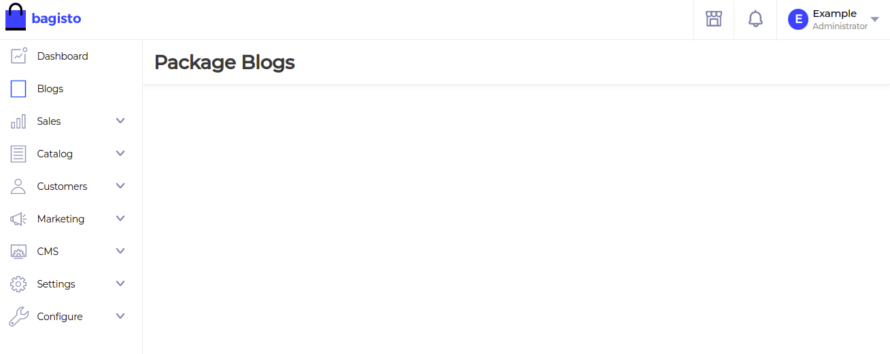

# Getting Started

There are two ways to create a package in **Bagisto**.

1. Using Bagisto Package Generator (**Recommended**)
2. By manually setting up all files (**Expert Level**)

## 1. Using Bagisto Package Generator

- You need to install [Bagisto Package Generator](https://github.com/bagisto/bagisto-package-generator).

- If you have not installed this package then you need to go to the root folder of **Bagisto** and run the following command

  ```php
  composer require bagisto/bagisto-package-generator
  ```

- Now, to generate your package you need to use the following command,

  - If the package directory does not exist,

    ```php
    php artisan package:make Webkul/Blog
    ```

  - If somehow the package directory is already present then you can use the force command as well. For that you just need to pass the '**--force**' command.

    ```php
    php artisan package:make Webkul/Blog --force
    ```

- Now check your `packages` directory, everything is setup for you.

- After that, you need to register your service provider in `config/app.php`.

  ```php
  <?php

  return [
      ...
      'providers' => [
          ...
          Webkul\Blog\Providers\BlogServiceProvider::class,
          ...
      ]
      ...
  ];
  ```

- Add you package namespace in `psr-4` key in `composer.json` file for auto loading which is located in Bagisto root directory.

  ```json
  "autoload": {
      ...
      "psr-4": {
          ...
          "Webkul\\Blog\\": "packages/Webkul/Blog/src"
          ...
      }
      ...
  }
  ```

- Run the below listed command:

  ```php
  composer dump-autoload
  php artisan optimize
  ```

  ```php
  php artisan vendor:publish --force

  -> Press the number before "Webkul\Blog\Providers\BlogServiceProvider" and then press enter to publish all assets and configurations.
  ```

::: details Check output in the browser



:::

- Now start creating something cool.

## 2. By manually setting up all files

By manually setting up package, we assume that you are familiar with packages directory structures and flow. In Bagisto we are already created multiple packages so let's start with bagisto default `package` folder.

### Step-1

- In `packages/Webkul` folder, create a folder with your package name. So, your basic structure will look like this,

  ```
  - packages/
    - Webkul/
        ...
      - Blog/
        ...
  ```

### Step-2

- In your package folder, create a folder named as `src`. This is the place where you need to put all your files related to your package. Now, your updated structure will look like this,

  ```
  - packages/
    - Webkul/Blog/
      - src/
  ```

### Step-3

- In `src` folder, create a folder named as `Providers` and inside that folder, create a file named as `BlogServiceProvider.php`.

- Copy the below code and paste it in `BlogServiceProvider.php`,

  ```php
  <?php

  namespace Webkul\Blog\Providers;

  use Illuminate\Support\ServiceProvider;

  /**
  * BlogServiceProvider
  *
  * @copyright 2023 Webkul Software Pvt. Ltd. (http://www.webkul.com)
  */
  class BlogServiceProvider extends ServiceProvider
  {
      /**
      * Bootstrap services.
      *
      * @return void
      */
      public function boot()
      {

      }

      /**
      * Register services.
      *
      * @return void
      */
      public function register()
      {

      }
  }
  ```

### Step-4

- Now, register your service provider in `config/app.php` which is located in Bagisto root directory.

  ```php
  <?php

  return [
      ...
      'providers' => [
          ...
          Webkul\Blog\Providers\BlogServiceProvider::class,
          ...
      ]
      ...
  ];
  ```

### Step-5

- Add your package namespace in `psr-4` key in `composer.json` file for auto loading which is located in Bagisto root directory.

  ```json
  "autoload": {
      ...
      "psr-4": {
          ...
          "Webkul\\Blog\\": "packages/Webkul/Blog/src"
          ...
      }
      ...
  }
  ```

- Run `composer dump-autoload` to load your package. Now your package is ready to use.