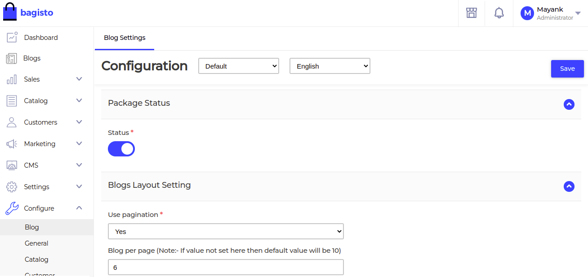

# Custom configuration

Creating a custom configuration ease the task for a developer or any non-developer person. Generally, in Bagisto, you can find it in admin panel **Configuration Menu**.

### Step-1

- To create a custom configuration for your application, you just need to create a `system.php` file in the `Config` folder of your package.

- Inside the file, you can include the code below,

  ~~~php
  <?php

  return [
      [
          'key' => 'blog',
          'name' => 'Blog',
          'sort' => 1
      ], [
          'key' => 'blog.settings',
          'name' => 'Blog Settings',
          'sort' => 1,
      ], [
          'key' => 'blog.settings.package',
          'name' => 'Package Status',
          'sort' => 1,
          'fields' => [
              [
                  'name' => 'status',
                  'title' => 'Status',
                  'type' => 'boolean',
                  'validation' => 'required'
              ]
          ]
      ], [
          'key'    => 'blog.settings.blog-setting',
          'name'   => 'blog::app.admin.system.blog-setting',
          'sort'   => 2,
          'fields' => [
              [
                  'name'          => 'pagination',
                  'title'         => 'blog::app.admin.system.pagination',
                  'type'          => 'select',
                  'validation' => 'required',
                  'options'       => [
                      [
                          'title' => 'Yes',
                          'value' => 1,
                      ], [
                          'title' => 'No',
                          'value' => 0,
                      ],
                  ]
              ],
              [
                  'name'  => 'items',
                  'title' => 'blog::app.admin.system.items',
                  'type'  => 'number',
                  'validation' => 'numeric'
              ]
          ]
      ]
  ];
  ~~~

#### Explanation for the keys

- **key**    : This key accept the unique value and nested with '.' (dot) operator.

- **name**   : This key accept the value as a placeholder for your configuration. Generally, in Bagisto, we consider writing it using translation.

- **sort**   : This key accept the sort position for the configuration menu.

- **fields** : This key accept the array for the value of the custom configuration.

- We need to merge these custom config also,

### Step-2

  ~~~php
  <?php

  namespace Webkul\Blog\Providers;

  use Illuminate\Support\Facades\Event;
  use Illuminate\Support\ServiceProvider;

  /**
  * BlogServiceProvider
  *
  * @copyright 2020 Webkul Software Pvt. Ltd. (http://www.webkul.com)
  */
  class BlogServiceProvider extends ServiceProvider
  {
      /**
      * Register services.
      *
      * @return void
      */
      public function register()
      {
          $this->mergeConfigFrom(
              dirname(__DIR__) . '/Config/admin-menu.php', 'menu.admin'
          );

          $this->mergeConfigFrom(
              dirname(__DIR__) . '/Config/acl.php', 'acl'
          );

          $this->mergeConfigFrom(
              dirname(__DIR__) . '/Config/system.php', 'core'
          );
      }
  }
  ~~~

- Run this command i.e. `php artisan optimize`.

- Now, check the configuration,

  

## Supported Field Types

There are several field types supported by the Bagisto. Let us know all of them,

- Text Type
- Number Type
- Boolean Type
- Select Type
- Textarea Type
- Image Type

Let's get started with the first one.

### Text Type

This field type will give you the input field of type text.

#### Example

~~~php
return [
    ...
    [
        'key'    => 'general.general.custom-types',
        'name'   => 'admin::app.admin.system.custom-types',
        'sort'   => 1,
        'fields' => [
            [
                'name'          => 'text_type',
                'title'         => 'admin::app.admin.system.text-type',
                'type'          => 'text',
                'default_value' => '',
            ],
        ],
    ],
    ...
];
~~~

### Number Type

This field type will give you the input field of type number.

#### Example

~~~php
return [
    ...
    [
        'key'    => 'general.general.custom-types',
        'name'   => 'admin::app.admin.system.custom-types',
        'sort'   => 1,
        'fields' => [
            [
                'name'  => 'number_type',
                'title' => 'admin::app.admin.system.number-type',
                'type'  => 'number',
            ],
        ],
    ],
    ...
];
~~~

### Boolean Type

This field type will give you the enable/disable switch.

#### Example

~~~php
return [
    ...
    [
        'key'    => 'general.general.custom-types',
        'name'   => 'admin::app.admin.system.custom-types',
        'sort'   => 1,
        'fields' => [
            [
                'name'          => 'boolean_type',
                'title'         => 'admin::app.admin.system.boolean-type',
                'type'          => 'boolean',
            ],
        ],
    ],
    ...
];
~~~

### Select Type

This field type will give you the select field with mentioned options.

#### Example

~~~php
return [
    ...
    [
        'key'    => 'general.general.custom-types',
        'name'   => 'admin::app.admin.system.custom-types',
        'sort'   => 1,
        'fields' => [
            [
                'name'          => 'select_type',
                'title'         => 'admin::app.admin.system.select-type',
                'type'          => 'select',
                'options'       => [
                    [
                        'title' => 'option_1',
                        'value' => 'value_1',
                    ], [
                        'title' => 'option_2',
                        'value' => 'vallue_2',
                    ],
                ],
            ],
        ],
    ],
    ...
];
~~~

### Textarea Type

This field type will give you the textarea field mostly used for long text.

#### Example

~~~php
return [
    ...
    [
        'key'    => 'general.general.custom-types',
        'name'   => 'admin::app.admin.system.custom-types',
        'sort'   => 1,
        'fields' => [
            [
                'name'          => 'textarea_type',
                'title'         => 'admin::app.admin.system.textarea-type',
                'type'          => 'textarea'
            ],
        ],
    ],
    ...
];
~~~

### Image Type

This field type will give you the file upload option for uploading the images.

#### Example

~~~php
return [
    ...
    [
        'key'    => 'general.general.custom-types',
        'name'   => 'admin::app.admin.system.custom-types',
        'sort'   => 1,
        'fields' => [
            [
                'name'          => 'image_type',
                'title'         => 'admin::app.admin.system.image-type',
                'type'          => 'image',
                'validation'    => 'mimes:bmp,jpeg,jpg,png,webp',
            ],
        ],
    ],
    ...
];
~~~
