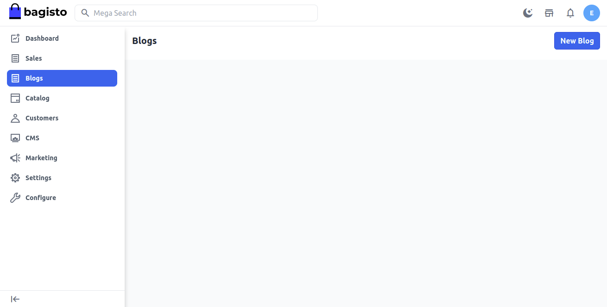

# Admin Menu

[[TOC]]

## Directory Structure

To ensure that the admin menu includes the necessary configuration, follow these steps:

1. In your package's source directory, which is typically located at **`packages/Webkul/Blog/src`**, create a new folder named **`Config`** if it doesn't already exist.
   ```
    └── packages
        └── Webkul
            └── Blog
                └── src
                    ├── ...
                    └── Config
                        └── admin-menu.php
   ```

2. Inside the newly created **`Config`** folder, create a file named **`admin-menu.php`**.

3. Copy and paste the following code into the **`admin-menu.php`** file:

    ```php
    <?php

    return [
        [
            'key'   => 'blogs',
            'name'  => 'Blogs',
            'route' => 'blog.admin.index',
            'sort'  => 2,
            'icon'  => 'icon-blog',
        ],
    ];
    ```

4. In your **`admin-routes.php`** file (located in the same package's source directory), add the named route **`blog.admin.index`** as follows:

    ```php
    Route::get('/blog', [PostController::class, 'index'])->name('blog.admin.index');
    ```

    In this step, we define the route that corresponds to the menu item added in the previous step.

## Add Menu Icon

5. To add the menu icon, you need to add the icon font inside the  **`assets/fonts/font.woff`** file and then you need to add the icon code inside the **`assets/css/app.css`** file.

First, open the **`assets/fonts/font.woff`** file and add the menu icon font to it. Then, create a class in the **`assets/css/app.css`** file to use the icon.

- For example

    ```css
    .icon-blog:before {
        content: "\e929";  /* Your Icon Code */
    }
    ```

6. To merge the **`admin-menu.php`** configuration with the core menu file, use the **`mergeConfigFrom()`** method in the **`register()`** method of your package's service provider. Here's an example:

    ```php
    <?php

    namespace Webkul\Blog\Providers;

    use Illuminate\Support\ServiceProvider;

    class BlogServiceProvider extends ServiceProvider
    {
        /**
         * Register services.
         *
         * @return void
         */
        public function register()
        {
            $this->mergeConfigFrom(
                dirname(__DIR__) . '/Config/admin-menu.php', 'menu.admin'
            );
        }
    }
    ```

7. Finally, run the following command to optimize your application:

    ```
    php artisan optimize:clear
    ```

    After completing these steps, the menu item should appear in the admin panel.

    ::: details Admin Menu Output

    

    :::